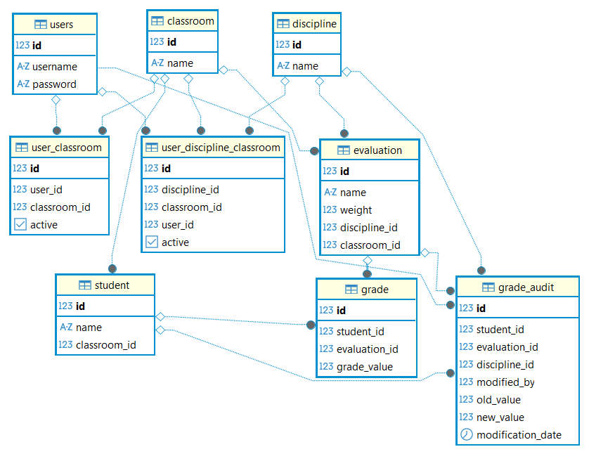
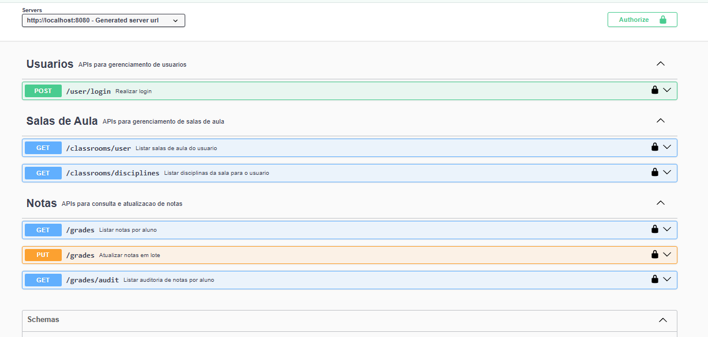

# Desafio Boletim Escolar

Aplicacao full stack para gestao de notas escolares, com autenticacao JWT, controle de acesso por usuario/turma/disciplina, lancamento em lote e auditoria de alteracoes de nota.

## Sumario

1. [Ideia do Projeto](#ideia-do-projeto)
2. [Arquitetura Geral](#arquitetura-geral)
3. [Arquitetura do Backend](#arquitetura-do-backend)
4. [Arquitetura do Frontend](#arquitetura-do-frontend)
5. [Regras de Negocio](#regras-de-negocio)
6. [Banco de Dados](#banco-de-dados)
7. [Stack Tecnologica](#stack-tecnologica)
8. [Pre-requisitos](#pre-requisitos)
9. [Como Rodar o Projeto](#como-rodar-o-projeto)
10. [Swagger (Documentacao da API)](#swagger-documentacao-da-api)
11. [Testes](#testes)
12. [Credenciais de Seed](#credenciais-de-seed)

## Ideia do Projeto

O sistema simula um boletim escolar onde o professor:

- faz login
- acessa apenas turmas e disciplinas autorizadas
- visualiza as notas em formato de grade (grid)
- edita notas de 0 a 10
- calcula media ponderada em tempo real
- salva em lote com um clique
- consulta historico de alteracoes via auditoria

## Arquitetura Geral

O repositorio possui dois apps principais:

- `backend/`: API REST em Spring Boot + H2 em memoria
- `frontend/`: SPA Angular consumindo a API por meio de proxy `/api`

Fluxo principal:

1. Usuario autentica em `POST /user/login`
2. Frontend salva token + dados do usuario no estado local
3. Front faz chamadas autenticadas para turmas, disciplinas, notas e auditoria
4. Backend valida permissoes com base no token JWT
5. Atualizacoes de nota geram auditoria automaticamente (trigger H2)

## Arquitetura do Backend

Padrao em camadas por modulo:

- `modules/*/controller`: endpoints REST
- `modules/*/service`: regras de negocio
- `modules/*/repository`: acesso a dados com Spring Data JPA
- `domain/*`: entidades JPA
- `common/*`: DTOs de erro, exceptions e validacoes de usuario autenticado
- `infra/*`: seguranca JWT, filtro middleware, OpenAPI e trigger H2

Modulos principais:

- `user`: login e emissao de JWT
- `classroom`: listagem de turmas e disciplinas por usuario
- `grade`: listagem de notas, atualizacao em lote e auditoria

Seguranca:

- Spring Security stateless
- `Middleware` valida Bearer Token e injeta dados do usuario no contexto
- `AuthenticatedUserValidator` protege acesso por:
  - `userId`
  - `classroomId`
  - `disciplineId`

### ACL (Access Control List)

O projeto aplica ACL em duas etapas:

1. validacao do JWT: a cada requisicao protegida, o `Middleware` valida assinatura/expiracao do token e extrai `userId`, turmas e disciplinas permitidas.
2. validacao de permissao da requisicao: no service, o `AuthenticatedUserValidator` compara os dados da chamada (usuario, turma, disciplina) com o escopo vindo do JWT; se nao houver permissao, retorna `401 Unauthorized`.

## Arquitetura do Frontend

Estrutura principal:

- `src/app/pages/login`: autenticacao
- `src/app/pages/home`: tela protegida com filtros e grid de notas
- `src/app/core/state/auth-state.service.ts`: estado de sessao + persistencia em `localStorage`
- `src/app/core/guards`: protecao de rotas (`authGuard` e `guestGuard`)
- `src/app/core/infra/libs/http/auth.interceptor.ts`: injeta token JWT no header `Authorization`

Rotas:

- `/login`: apenas visitante (nao autenticado)
- `/home`: apenas usuario autenticado

Fluxo da tela Home:

1. carrega turmas do usuario
2. ao selecionar turma, carrega disciplinas permitidas
3. ao selecionar disciplina, carrega grade de notas
4. exibe grid editavel por aluno x avaliacao
5. salva alteracoes em lote
6. abre modal de auditoria por aluno/disciplina

## Regras de Negocio

Autenticacao e autorizacao:

- login exige `username` e `password`
- token JWT contem `userId`, turmas e disciplinas permitidas
- usuario nao pode consultar dados de outro usuario
- usuario nao pode acessar turma/disciplina fora do seu escopo

Notas:

- valor permitido: `0` a `10`
- media exibida no front: media ponderada `sum(nota*peso) / sum(pesos)`
- se nao houver notas validas para o aluno, a media exibida e `-`
- pesos validos de avaliacao: `1` a `5` (considerados no calculo)
- salvamento em lote em um unico `PUT /grades`

Integridade e upsert:

- existe restricao unica no banco para `GRADE(student_id, evaluation_id)`
- no backend, quando nao ha `gradeId`, o sistema faz busca por `studentId + evaluationId`
- se existir registro, faz update
- se nao existir, faz insert

Auditoria:

- trigger H2 registra alteracoes em `GRADE_AUDIT`
- registra valor antigo, novo valor, data e usuario que modificou
- backend seta `@MODIFIED_BY` durante o `saveAllAndFlush`

## Banco de Dados

Banco utilizado: H2 em memoria, inicializado por scripts:

- `backend/src/main/resources/schema.sql`
- `backend/src/main/resources/data.sql`

Entidades principais:

- `users`
- `classroom`
- `student`
- `discipline`
- `evaluation`
- `grade`
- `grade_audit`
- `user_classroom`
- `user_discipline_classroom`

Relacoes importantes:

- aluno pertence a turma
- avaliacao pertence a disciplina e turma
- nota liga aluno + avaliacao
- auditoria liga aluno + avaliacao + disciplina + usuario que alterou

Diagrama de classes/modelo:



## Stack Tecnologica

Backend:

- Java 17
- Spring Boot 3.5.x
- Spring Web
- Spring Data JPA
- Spring Security
- H2 Database
- Springdoc OpenAPI (Swagger UI)
- JJWT
- JUnit 5 (testes)

Frontend:

- Angular 21
- TypeScript
- RxJS
- Angular Router
- Angular Material/CDK
- SCSS

## Pre-requisitos

- Java 17+
- Node.js (recomendado: versao LTS)
- npm
- Maven (ou Maven Wrapper `mvnw` dentro de `backend/`)

## Como Rodar o Projeto

### 1) Backend

No terminal:

```bash
cd backend
./mvnw spring-boot:run
```

Se estiver no Windows PowerShell:

```powershell
cd backend
.\mvnw.cmd spring-boot:run
```

API: `http://localhost:8080`

H2 Console: `http://localhost:8080/h2-console`

Configuracao padrao H2:

- JDBC URL: `jdbc:h2:mem:testdb`
- User: `sa`
- Password: (vazio)

### 2) Frontend

Em outro terminal:

```bash
cd frontend
npm install
npm start
```

Aplicacao: `http://localhost:4200`

Observacao: o proxy do Angular (`frontend/proxy.conf.json`) redireciona `/api/*` para `http://localhost:8080`.

## Swagger (Documentacao da API)

Com o backend rodando:

- Swagger UI: `http://localhost:8080/swagger-ui/index.html`
- OpenAPI JSON: `http://localhost:8080/v3/api-docs`

Imagem do Swagger:



## Testes

Backend:

- Teste basico de contexto: `BackendApplicationTests`
- Testes E2E com requisicoes reais (sem mocks): `BackendE2ETest`

Para rodar testes no backend:

```bash
cd backend
./mvnw test
```

Para rodar somente E2E:

```bash
cd backend
./mvnw -Dtest=BackendE2ETest test
```

## Credenciais de Seed

Usuarios disponiveis no `data.sql`:

- `admin / 123456`
- `joao / 123456`
- `maria / 123456`
- `ana / 123456`
- `carlos / 123456`
